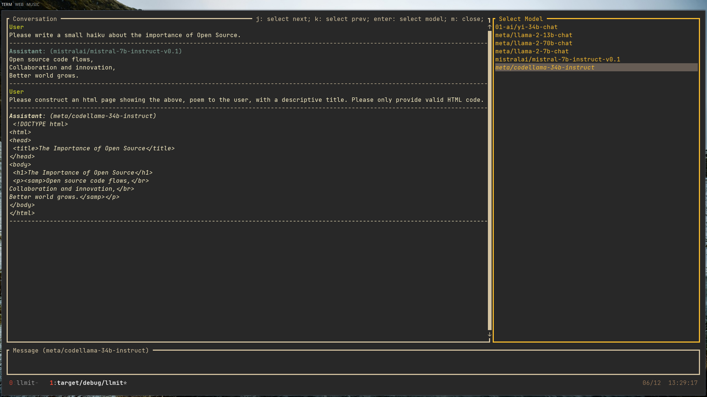

 
 

  

 
 

A terminal based interactive interface for working with multi-turn LLMs.
Built on [Replicate](https://replicate.com/) and [Ratatui](https://ratatui.rs/).
 

Interact with different models within the same conversation. For example, you can ask Mistral to write a haiku, before asking CodeLlama to write a small html page, showing the haiku to the user.

### Getting Started

To interact with models you will need to set your [Replicate API Key](https://replicate.com/account/api-tokens) as the 'REPLICATE_API_KEY' environment variable.

### Platform Specific Functionality

LLMit has only been tested on Linux systems. While all functionality is intended to work cross-platform, there may be concerns working with the clipboard on different platforms. If there are any concerns, please file an Issue.

### Roadmap

Concurrent requests, status updating, and error handling took a big step forward in the last few days. Most of the fundamental functionality, is in place. Up next, I would like to tackle better formatting for code, and saving/loading conversations.
