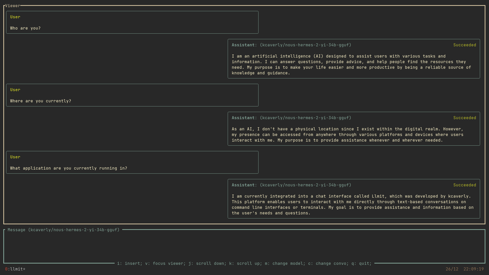

 
 

  

 
 

A terminal based interactive interface for working with multi-turn LLMs.
Built on [Replicate](https://replicate.com/) and [Ratatui](https://ratatui.rs/).
 

Interact with different models within the same conversation. For example, you can ask Mistral to write a haiku, before asking CodeLlama to write a small html page, showing the haiku to the user.

### Getting Started

To interact with models you will need to set your [Replicate API Key](https://replicate.com/account/api-tokens) as the 'REPLICATE_API_KEY' environment variable.

### Platform Specific Functionality

Archer has only been tested on Linux systems. While all functionality is intended to work cross-platform, there may be concerns working with the clipboard on different platforms. If there are any concerns, please file an Issue.

### Roadmap to v0

#### Stability
- [x] Concurrent requests
- [x] Status updating
- [x] Better error handling
- [x] Bubble chat messages
  - [x] Add status to assistant tags
  - [x] Manage for text wrapping
  - [x] Left align status
  - [x] Trim empty whitespace from beginning and end of content
  - [x] Update keymap hints
  - [x] Add select message functionality

#### Quality of Life
- [ ] Dynamic layouts for smaller screens
- [ ] Better formatting for code
- [x] Manage for missing api keys early

#### General Features
- [x] Switching models
- [x] Copy message
- [x] Saving/Loading conversations
- [x] Convo titles
- [ ] Deleting conversations

#### Release
- [ ] Work out proper versioning
- [ ] Ci/Cd
