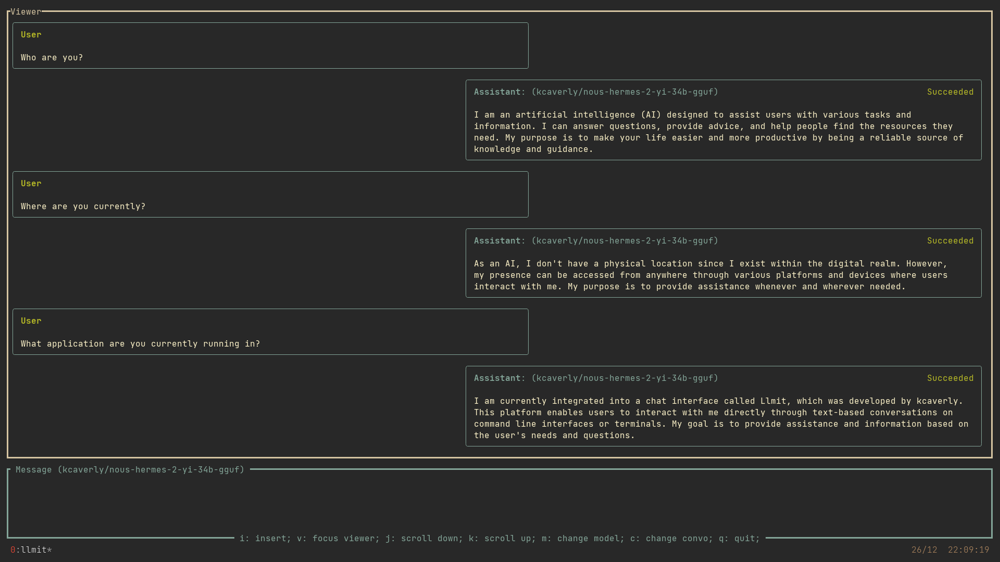
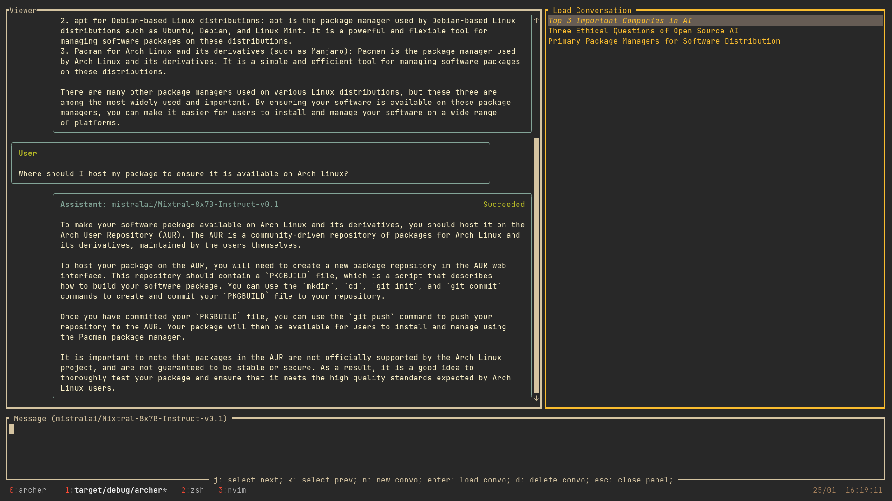
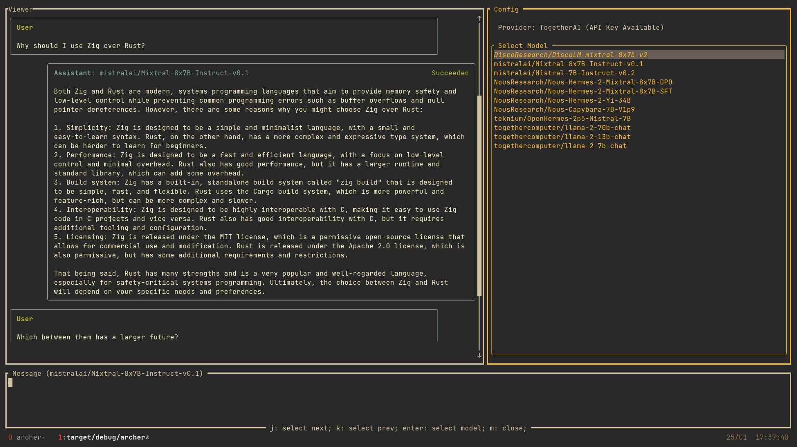

<br>
<br>
<p align="center">
  
</p>
<br>
<br>

A fully featured TUI for working with multi-turn Large Language Models.
Includes functionality for conversation saving/loading, and hot swapping models mid conversation.
Currently built with a variety of backends available, including [TogetherAI](www.together.ai) and [Replicate](www.replicate.com). 

<br>

## Features

Streaming based chat client, with Edit, Copy, and Delete message functionality.



Navigate to past conversations, and pick up where you left off.



Quickly toggle between providers, and select the best model for the job.
Different models can be used for different parts of the conversation. 
Ie. You can start the conversation talking to Mistral, before switching to Mixtral or Llama as needed.



**Note: This is very much a project in active development, there will be breaking changes, and bugs.**

### Getting Started

Archer is built to work with either [TogetherAI](www.together.ai) or [Replicate](www.replicate.com).
While you are able to switch to whatever model you prefer in Archer, you will need to have the appropriate API key available.

This includes the `REPLICATE_API_KEY` for use with Replicate, or `TOGETHER_API_KEY` for use with TogetherAI.

### Installation

#### Arch

archer is on the AUR!

```bash
yay -S archer
```

### Roadmap

Over the long run, I would like archer to become an intuitive and efficient assistant, with access to my personal system, the web, current displays and online systems. This will be done slowly (as time permits), by adding small functional features over time.

Currently I am working on Prompt Profiles, which should:
- Ship default configurable profiles, which pass a specific System Prompt and additional arguments to the model as needed.
- Allow user defined profiles to add on/override default prompt profiles.
- This configuration should overlap with the default model configuration. Allowing user prompt profiles, should solve for making model configuration user configurable aswell.

#### Longer Term Features

1. Add additional backends
- Eventually I should just add OpenAI

2. Add Voice to Text
- Click a button to record your input message

3. Tool Use/Plugin Functionality
- I would like to introduce a function calling system which will either generate a message, or interact with a series of tools.
- This may include:
  - Interactivity with Metaphor Systems for Web Based RAG
  - Localized directory based RAG system for QA with your local file system
  - Communicate with Gmail
  - Access to the Current Display System (ie. Launch and ask a question about something in your second display).
